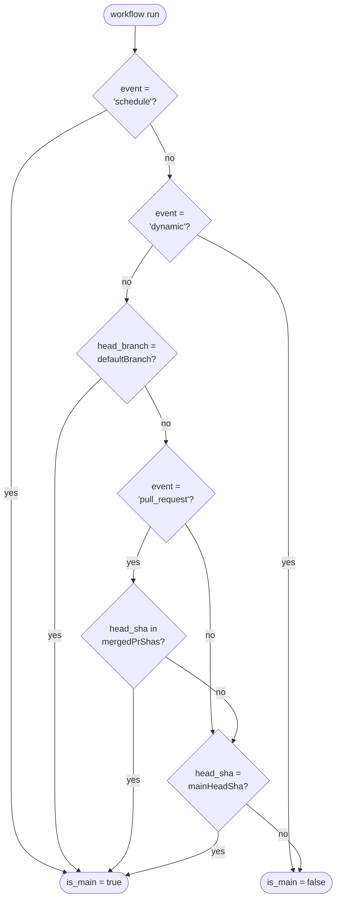
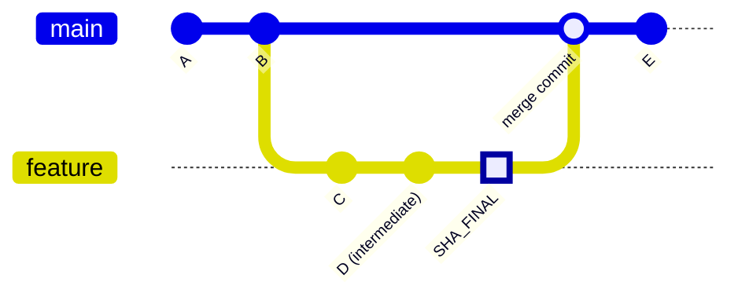
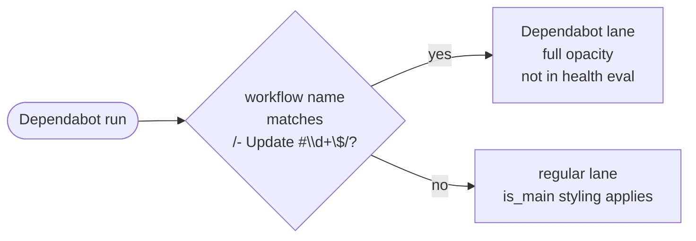

# Workflow Run Classification: `is_main`

Every collected workflow run is tagged `is_main: boolean` before it is stored in `WorkflowRunsData`. Health evaluation
(`evalWorkflowHealth`) and visual weight in the report both depend on this flag.

## Rule

```text
is_main = event === 'schedule'
       || (event !== 'dynamic' && head_branch === defaultBranch)
       || (event === 'pull_request' && mergedPrShas.has(head_sha))
       || (mainHeadSha !== null && head_sha === mainHeadSha)
```

A run is `is_main` when it **changes or verifies the state of the default branch**:

| Clause                                                 | What it captures                                                                                                                                                              |
| ------------------------------------------------------ | ----------------------------------------------------------------------------------------------------------------------------------------------------------------------------- |
| `event === 'schedule'`                                 | Cron jobs -- always run against the default branch's workflow file                                                                                                            |
| `event !== 'dynamic' && head_branch === defaultBranch` | Any event whose execution context is the default branch itself (push to main, workflow_dispatch on main, etc.) -- Dependabot orchestration (`dynamic`) is explicitly excluded |
| merged-PR SHA                                          | The final commit of a PR whose gates passed before the merge                                                                                                                  |
| `head_sha === mainHeadSha`                             | Any run on the current default branch HEAD -- covers tag-push release workflows where `head_branch` is the tag ref (`v1.0.0`) rather than the branch name                     |

Variables:

- `event` -- the GitHub Actions trigger event name (`push`, `pull_request`, `schedule`, ...)
- `head_branch` -- the branch or ref name the run executed against
- `defaultBranch` -- the repository's default branch (e.g. `main`)
- `head_sha` -- the commit SHA the run executed against
- `mergedPrShas` -- set of `head.sha` values from the 30 most recently merged PRs into the default branch
  (`GET /pulls?state=closed&base={defaultBranch}&sort=updated`)
- `mainHeadSha` -- SHA of the current default branch HEAD (`GET /repos/{owner}/{repo}/commits/{defaultBranch}`)

### Decision Flow



## Event-by-Event Reference

| Event                                    | `is_main` | Condition                       | Rationale                                                                                                              |
| ---------------------------------------- | --------- | ------------------------------- | ---------------------------------------------------------------------------------------------------------------------- |
| `push` (to default branch)               | `true`    | `head_branch === defaultBranch` | Direct commit on main                                                                                                  |
| `push` (to non-default branch)           | `false`   | neither clause matches          | Feature-branch push; not main state                                                                                    |
| `push` (to a tag on HEAD, e.g. `v1.0.0`) | `true`    | `head_sha === mainHeadSha`      | Tag cut from the current default branch HEAD -- release workflows verify the releasability of main                     |
| `push` (to a tag on older commit)        | `false`   | SHA is not mainHeadSha          | Tag on a commit no longer at HEAD; the relevant push-to-main run was already captured                                  |
| `push` (to non-default branch)           | `false`   | neither clause matches          | Feature-branch push; not main state                                                                                    |
| `dynamic` (Dependabot orchestration)     | `false`   | Explicitly excluded             | Dependabot orchestration runs on main to create/update dependency PRs -- it does not verify the repo's own code health |
| `schedule`                               | `true`    | `event === 'schedule'`          | Periodic run against the default branch's workflow file                                                                |
| `workflow_dispatch` (on default branch)  | `true`    | `head_branch === defaultBranch` | Manual trigger on main                                                                                                 |
| `workflow_dispatch` (on another branch)  | `false`   | `head_branch` != default        | Operator explicitly chose a non-main target                                                                            |
| `pull_request` (non-merged SHA)          | `false`   | SHA not in mergedPrShas         | PR iteration -- development noise                                                                                      |
| `pull_request` (merged SHA)              | `true`    | SHA in mergedPrShas             | Final commit whose gates passed before merge                                                                           |
| `pull_request_target`                    | depends   | `head_branch` check             | Runs in the target-repo context; `head_branch` is the target (usually main) --> `true`                                 |
| `merge_group`                            | `true`    | `head_branch === defaultBranch` | Merge queue commit about to land on main                                                                               |
| `release`                                | depends   | `head_branch` check             | Only `true` if the release workflow runs against the default branch                                                    |
| `repository_dispatch`                    | depends   | `head_branch` check             | Only `true` if dispatched against the default branch                                                                   |
| `workflow_call` (reusable)               | depends   | `head_branch` check             | Inherits the caller's branch; only `true` if called from main                                                          |
| `create` / `delete`                      | depends   | `head_branch` check             | Only `true` if the branch event targets the default branch                                                             |

## The Merged-PR SHA Bridge

A `pull_request` run whose `head_sha` equals the tip SHA of a recently merged PR becomes `is_main = true`. This covers
repos that run CI exclusively on PR events (no `push` trigger on the default branch).

Only `pr.head.sha` (the tip at merge time) is included. Intermediate commits from earlier pushes to the PR branch are
never in the set, regardless of merge strategy (squash / rebase / merge commit).



`mergedPrShas` contains `SHA_FINAL` (the highlighted tip). Commits C and D are intermediate -- PR runs on those SHAs
remain `is_main = false`.

## Dependabot Runs

Dependabot runs fall into two display categories, but `is_main` follows the standard rule:



**Dependabot orchestration runs** (`dynamic` event, `head_branch = defaultBranch`): triggered by Dependabot's
grouped-update mechanism. Despite `head_branch = defaultBranch` they are **explicitly excluded** from `is_main`
(`event !== 'dynamic'` guard). They coordinate dependency PR creation and do not verify the repo's own code health.

The Dependabot lane is **purely informational**: all runs are displayed at full opacity with their conclusion colour
regardless of `is_main`. The `other` (dimmed/dashed) styling is not applied in this lane. The lane label reads
**"Dependabot (info)"** to signal that it does not contribute to the health score.

**Dependabot PR CI runs** (`pull_request` event): these runs appear in the **regular workflow lane** for the CI workflow
(e.g. "CI", "Test"), not in the Dependabot lane. `is_main` follows the merged-PR SHA bridge -- `true` only if the PR was
merged and the run is on the tip SHA.

**`Dependabot Auto-Merge` workflow**: name does not match `DEPENDABOT_RUN`, so it appears in its own regular lane.
`is_main` follows the standard rule (merged-SHA lookup for `pull_request` events).

## Run Tooltip Format

Each workflow run cell shows a tooltip on hover with the format:

```text
{trigger-type} &middot; {target} &middot; {date}
```

| Field          | Description                                  |
| -------------- | -------------------------------------------- |
| `trigger-type` | Human-readable event label (see table below) |
| `target`       | `head_branch`, truncated to 30 characters    |
| `date`         | `created_at` formatted as `Mon DD`           |

Trigger-type mapping:

| Event                                   | `is_main` | Tooltip trigger-type                              |
| --------------------------------------- | --------- | ------------------------------------------------- |
| `schedule`                              | `true`    | `schedule`                                        |
| `pull_request`                          | `true`    | `pull_request merge`                              |
| `pull_request`                          | `false`   | `pull_request iteration`                          |
| `push` + `head_branch` matches `/^v\d/` | any       | `push tag`                                        |
| any other event                         | --        | raw event name (e.g. `push`, `workflow_dispatch`) |

The Dependabot lane uses a different tooltip: `{stripped workflow name} &middot; {date}`.

## Known Limitations and Edge Cases

| Case                                                                         | Behaviour                                                                          | Why Acceptable                                                                                                                       |
| ---------------------------------------------------------------------------- | ---------------------------------------------------------------------------------- | ------------------------------------------------------------------------------------------------------------------------------------ |
| Tag push on current HEAD (`on: push: tags:`)                                 | `is_main = true` (SHA equals mainHeadSha)                                          | Tag was cut from the current HEAD of main; the release workflow verifies releasability of that commit                                |
| Tag push on an older commit                                                  | `is_main = false` (SHA != mainHeadSha)                                             | The relevant push-to-main run was already captured at the time that commit was HEAD; re-tagging older commits is not a health signal |
| `schedule` run pointing at non-default branch                                | `is_main = true` (event clause)                                                    | Extremely rare; requires an explicit `branches` override in the schedule trigger. Accepted trade-off for simplicity                  |
| `workflow_dispatch` on a non-default branch                                  | `is_main = false` (branch check)                                                   | Operator explicitly chose another branch; handled correctly                                                                          |
| Merged-PR window is 30 PRs                                                   | PRs merged more than 30 merges ago have `is_main = false` for their PR runs        | Health signal is about recent activity; stale PR runs do not affect current health evaluation                                        |
| Reusable workflows (`workflow_call`)                                         | Depends on caller's `head_branch`                                                  | Inherits caller context correctly                                                                                                    |
| `pull_request` from a fork whose branch is named `main`                      | `is_main = false` (event check, SHA not in mergedPrShas unless that PR was merged) | Correctly handled; the old `head_branch === defaultBranch` approach misclassified this as `true`                                     |
| `dynamic` runs that do something other than Dependabot dependency management | `is_main = false` (event excluded unconditionally)                                 | The `dynamic` event is Dependabot-specific in GitHub Actions; no other trigger uses it                                               |
| Re-run on merged-PR tip SHA                                                  | Both the failed original run and the successful retry are `is_main = true`         | The failed run contributes a warning signal even though the commit eventually passed                                                 |
| PR merged with failing CI on tip SHA                                         | `is_main = true`, `conclusion = failure` --> health status `failed`                | Real finding: branch protection did not require passing CI before merge                                                              |

## Code Locations

| Concern                  | File                                                                             |
| ------------------------ | -------------------------------------------------------------------------------- |
| `is_main` computation    | `src/collectors/workflow-runs.ts` -- `isMain()`                                  |
| Merged-PR fetch          | `src/collectors/workflow-runs.ts` -- `client.listMergedPullRequests()`           |
| Health evaluation filter | `src/policy.ts` -- `evalWorkflowHealth()`                                        |
| Dependabot detection     | `src/report.ts` -- `DEPENDABOT_RUN` constant                                     |
| Dependabot display lane  | `src/report.ts` -- `workflowSection()`                                           |
| Run tooltip              | `src/report.ts` -- `runTooltipTitle()`, `triggerType()`, `truncTarget()`         |
| `WorkflowRun` type       | `src/types.ts` -- includes `event`, `head_branch`, `is_main`                     |
| API contract             | `src/github/client.ts` -- `GitHubWorkflowRun.event`, `.head_branch`, `.head_sha` |
